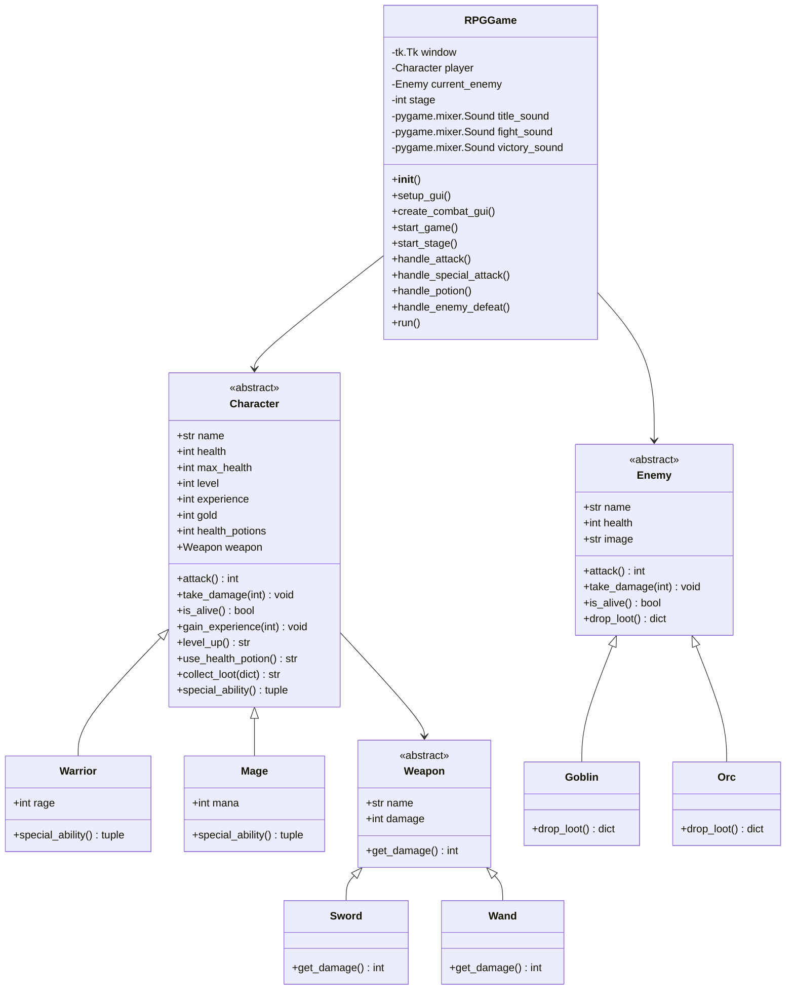

# Residência TI Adventure

Um jogo RPG simples desenvolvido em Python, onde o jogador pode escolher entre um Guerreiro ou Mago para enfrentar inimigos em diferentes fases.

## Requisitos

- Python 3.8 ou superior
- Bibliotecas necessárias:
  - tkinter (geralmente já vem com o Python)
  - Pillow (PIL)
  - pygame

## Instalação

1. Clone o repositório ou baixe os arquivos do projeto
2. Instale as dependências necessárias:
```bash
pip install pillow pygame
```

## Como Jogar

1. Execute o arquivo principal:
```bash
python game.py
```

2. Na tela inicial:
   - Selecione seu personagem (Guerreiro ou Mago)
   - Digite seu nome
   - Clique em "Começar Jogo"

3. Durante o jogo:
   - Use o botão "Atacar" para realizar ataques básicos
   - Use o botão "Ataque Especial" para habilidades especiais
   - Use o botão "Usar Poção" para recuperar vida
   - Monitore seus recursos (Raiva para Guerreiro, Mana para Mago)

4. Objetivo:
   - Complete todas as 5 fases
   - Derrote os inimigos (Goblins nas fases 1-2, Orcs nas fases 3-5)
   - Mantenha seu personagem vivo

## Personagens

### Guerreiro
- Ataque básico: 10 de dano
- Ataque especial: 25 de dano (consome 30 de Raiva)
- Recupera 10 de Raiva por ataque
- Mais resistente

### Mago
- Ataque básico: 8 de dano
- Ataque especial: 30 de dano (consome 40 de Mana)
- Recupera 15 de Mana por ataque
- Mais frágil

## Diagrama de Classes



## Recursos

- Interface gráfica com Tkinter
- Efeitos sonoros e música de fundo
- Sistema de combate por turnos
- Sistema de níveis e experiência
- Sistema de loot
- Poções de vida para recuperação

## Observações

- Certifique-se de que todos os arquivos de assets (imagens e sons) estejam presentes na pasta `assets/`
- O jogo salva automaticamente o progresso durante a sessão
- Para sair do jogo, feche a janela ou derrote todos os inimigos
